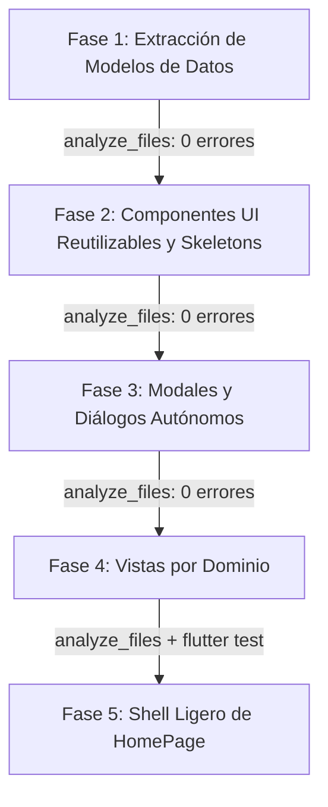

# Plan de Modularización y Arquitectura Sostenible para `home_page.dart`

## 1. Diagnóstico e Inconvenientes Actuales

El archivo `frontend/lib/features/dashboard/presentation/home_page.dart` cuenta actualmente con **17.319 líneas de código**, **128 clases y enums**, y un único estado (`_HomePageState`) que abarca **7.926 líneas y más de 100 métodos**.

Este patrón de diseño ("*God File*" o archivo monolítico) genera serios problemas técnicos y operativos:

### 1.1 Violación Extrema de Responsabilidad Única (SRP)
En un único archivo conviven dominios y responsabilidades totalmente dispares:
- **Capa de Datos y DTOs** (~2.000 líneas al final del archivo): Clases de entidades como `Cliente`, `CreditoRegistro`, `CobroRuta`, `MovimientoCaja`, `Presupuesto`, `Sesion`, `Catalogos`, `EmpleadoGestion`, `ExportacionExcel`, etc.
- **Lógica de Negocio y Financiera**: Cálculos de amortización, fórmulas de cuotas (`_CalculoCredito`), validaciones presupuestarias y redondeos monetarios.
- **Red y Persistencia Offline**: Llamadas directas al `ApiClient`, sincronización en segundo plano y persistencia local de acciones pendientes.
- **Pantallas Completas**: Vistas enteras como la gestión de empleados (`_GestionEmpleadosPage`, ~1.000 líneas), el dashboard de presupuesto (`_PaginaInicioPresupuesto`), la ruta diaria, caja menor, etc.
- **Modales y Diálogos Complejos**: Creación de clientes con GPS, refinanciación de créditos, recaudos múltiples, visor de tablas Excel.
- **Componentes UI y Animaciones**: Skeletons de carga, chips de estado, animaciones de billetes, barras de progreso.

### 1.2 Riesgo Crítico de Conflictos en Git (Merge Conflicts)
Cualquier cambio —ya sea en caja menor, geolocalización de clientes, créditos o visualización de gráficas— modifica obligatoriamente `home_page.dart`. Si dos tareas o desarrolladores trabajan en paralelo, los conflictos de fusión son casi garantizados y de resolución sumamente riesgosa.

### 1.3 Degradación de Herramientas y Productividad (DX)
- **Dart Analysis Server (LSP)**: Analizar un archivo de 17k líneas consume mucha memoria y retrasa el autocompletado y los diagnósticos en tiempo real.
- **Formateo**: Herramientas como `dart format` o linters tardan sensiblemente más en procesar el archivo.
- **Asistentes de IA**: Exige enviar y procesar payloads masivos de contexto para hacer cambios puntuales, aumentando la latencia y la posibilidad de regresiones.

### 1.4 Imposibilidad de Pruebas Unitarias Aisladas
Al estar la mayoría de clases de lógica, parsers y widgets declarados con visibilidad privada (`_`) dentro de `home_page.dart`, es imposible escribir tests unitarios enfocados en la lógica financiera o en componentes específicos sin levantar todo el árbol del `HomePage`.

### 1.5 Fragilidad del Estado de la UI
Tener decenas de controladores de texto (`TextEditingController`), variables de filtro, banderas booleanas y listas en un solo `_HomePageState` hace que cualquier `setState()` pueda provocar re-renderizados innecesarios de secciones no relacionadas.

---

## 2. Arquitectura Objetivo (Feature-First / Clean Layers)

Siguiendo las mejores prácticas recomendadas de Flutter y alineando la estructura del frontend con los módulos de dominio ya desacoplados en el backend:

```text
frontend/lib/
├── core/                                     # Infraestructura compartida existente
│   ├── network/                              # api_client.dart, offline_mutation.dart
│   ├── formatters/                           # money_formatter.dart
│   └── ui/                                   # clay.dart, app_theme.dart, cobro_dropdown.dart
│
├── data/models/                              # [FASE 1] Modelos de datos y DTOs independientes
│   ├── models.dart                           # Barrel exportador
│   ├── sesion_model.dart                     # Sesion, SesionUsuario, OrganizacionAdmin
│   ├── catalogo_model.dart                   # Catalogos, Moneda, FrecuenciaPago, etc.
│   ├── cliente_model.dart                    # Cliente
│   ├── credito_model.dart                    # CreditoRegistro, EstadoCreditoRegistro, etc.
│   ├── cobro_ruta_model.dart                 # CobroRuta, EstadoCobro
│   ├── caja_menor_model.dart                 # MovimientoCaja, TipoMovimientoCaja
│   ├── presupuesto_model.dart                # Presupuesto, PresupuestoItem, Totales
│   ├── empleado_model.dart                   # EmpleadoGestion, ActividadEmpleado
│   └── exportacion_model.dart                # ExportacionExcel, ExportacionVistaPrevia
│
└── features/                                 # Organizado por dominios de negocio
    ├── auth/presentation/widgets/            # Login y diálogo de sesión
    ├── presupuesto/presentation/             # Dashboard principal y métricas
    │   ├── inicio_presupuesto_view.dart
    │   └── widgets/                          # Tarjetas de resumen, filtros, composición
    ├── rutas/presentation/                   # Cartera activa y logística de cobro
    │   ├── ruta_cobro_view.dart
    │   └── widgets/                          # TarjetaCobroRuta, diálogos de abonos
    ├── creditos/presentation/                # Gestión de cartera y préstamos
    │   ├── creditos_view.dart
    │   └── widgets/                          # FormularioCredito, CalculoCredito, Refinanciación
    ├── caja_menor/presentation/              # Flujo de caja y tesorería
    │   ├── caja_menor_view.dart
    │   └── widgets/                          # MovimientoCajaItem, diálogo de movimiento
    ├── clientes/presentation/                # Maestro de clientes
    │   ├── clientes_view.dart
    │   └── widgets/                          # ClienteItem, ClienteUbicacionPicker
    ├── empleados/presentation/               # Administración y personal
    │   └── gestion_empleados_page.dart
    └── dashboard/presentation/
        ├── dashboard_charts.dart             # Gráficas existentes
        └── home_page.dart                    # Shell de navegación liviano (~250-300 líneas)
```

---

## 3. Plan de Ejecución Paso a Paso (Fases Seguras)



### Fase 1: Extracción de Capa de Datos (Modelos y DTOs) ✅ COMPLETADA
- **Objetivo**: Mover todas las clases de datos (líneas ~15.400 a ~17.319) a archivos modulares dentro de `frontend/lib/data/models/`.
- **Archivos creados**:
  - `sesion_model.dart`: `Sesion`, `SesionUsuario`, `OrganizacionAdmin`.
  - `catalogo_model.dart`: `Catalogos`, `UsuarioCatalogo`, `Moneda`, `FrecuenciaPago`, `MedioPago`, `TipoMovimientoCaja`, `RutaCatalogo`, `CajaMenorCatalogo`.
  - `cliente_model.dart`: `Cliente`.
  - `credito_model.dart`: `CreditoRegistro`, `EstadoCreditoRegistro`, `CreditoRefinanciacion`.
  - `cobro_ruta_model.dart`: `CobroRuta`, `EstadoCobro`.
  - `caja_menor_model.dart`: `MovimientoCaja`.
  - `presupuesto_model.dart`: `Presupuesto`, `PresupuestoItem`, `PresupuestoTotales`.
  - `empleado_model.dart`: `EmpleadoGestion`, `ActividadEmpleado`, `ActividadEmpleadoResumen`, `ActividadRutaEmpleado`, `EstadoActividadEmpleado`, `ActividadEmpleadosFiltros`.
  - `exportacion_model.dart`: `ExportacionExcel`, `ExportacionVistaPrevia`.
  - `models.dart`: Barrel file que re-exporta los anteriores.
  - `permisos_constants.dart` y `json_utils.dart`.
- **Impacto en `home_page.dart`**: Reducción de **1.403 líneas** (17.319 -> 15.916). Cero cambios visuales o de comportamiento.
- **Verificación**: `analyze_files` (0 errores). Commit: `bf66a6b`.

### Fase 2: Extracción de Componentes UI Reutilizables y Skeletons ✅ COMPLETADA
- **Objetivo**: Extraer componentes visuales genéricos, skeletons y formateadores puros.
- **Archivos creados**:
  - `app_formatters.dart`: Formateadores de moneda, fecha, números y funciones puras de parseo.
  - `skeletons.dart`: `SkeletonListaCreditos`, `SkeletonTarjetaCredito`, `SkeletonDatoCredito`, `SkeletonCreditoBloque`, `SkeletonListaMovimientosCaja`, `SkeletonTarjetaMovimientoCaja`.
  - `visor_exportacion_excel.dart`: `VisorExportacionExcel`, `EtiquetaExportacion`, `TablaVistaPreviaExcel`.
  - `aviso_flotante.dart`: `TipoMensaje`, `calcularTipoMensaje`, `AvisoFlotante`, `AvisoEstilo`, `ErrorBanner`.
  - `chips_indicadores.dart`: `EstadoCreditoChip`, `EtiquetaRefinanciacion`, `EtiquetaCreditoModificado`, `BarraSaldo`, `EstadoChip`, `DatoResumen`.
  - `marca_aplicacion.dart`: `MarcaAplicacion`.
- **Impacto en `home_page.dart`**: Reducción de **1.216 líneas** (15.916 -> 14.700). Total acumulado reducido: **2.619 líneas**.
- **Verificación**: `analyze_files` en `lib/` y `test/` (0 errores).

### Fase 3: Extracción de Modales y Formularios Autónomos ✅ COMPLETADA
- **Objetivo**: Desacoplar formularios y selectores a sus respectivas carpetas por feature:
  - `core/ui/modal_layouts.dart`: `DialogContent`, `DosColumnas`.
  - `features/clientes/presentation/widgets/cliente_ubicacion_picker.dart`: `ClienteUbicacionPicker`.
  - `features/creditos/presentation/widgets/calculo_credito.dart`: `CalculoCredito`.
  - `features/creditos/presentation/widgets/resumen_credito_animado.dart`: `ResumenCreditoAnimado`, `FlujoBilletes`, `Billete`, `FlechaFlujo`, `PasoCalculo`.
  - `features/creditos/presentation/widgets/formulario_credito.dart`: `FormularioCredito`, `CamposCreditoSinCliente`, `SelectorClienteCredito`, `ClienteOpcionCredito`, `SelectorClientesCreditoMultiple`, `MontosClientesCredito`, `MontoClienteCreditoItem`, `etiquetaCliente`.
  - `features/rutas/presentation/widgets/selector_cobro_ruta_buscable.dart`: `SelectorCobroRutaBuscable`.
  - `features/rutas/presentation/widgets/selector_medio_pago_buscable.dart`: `SelectorMedioPagoBuscable`, `PagoRutaSolicitud`, `PagoRutaSeleccion`.
- **Impacto en `home_page.dart`**: Reducción de **3.221 líneas** (15.828 -> 12.607). Total acumulado reducido desde el inicio: **~4.712 líneas**.
- **Verificación**: `analyze_files` en todos los archivos modificados y nuevos (0 errores).


### Fase 4: Extracción de Vistas/Pantallas por Dominio ✅ COMPLETADA
- **Objetivo**: Convertir los métodos constructores gigantes (`_construirPresupuesto`, `_construirRutaActiva`, `_construirNuevoCredito`, `_construirCajaMenor`, `_construirClientes`, `_construirGestionEmpleados`) en widgets de vista dedicados:
  - `GestionEmpleadosPage` (`features/empleados/presentation/gestion_empleados_page.dart`).
  - `PaginaInicioPresupuesto` (`features/presupuesto/presentation/inicio_presupuesto_view.dart`).
  - `RutaCobroView` (`features/rutas/presentation/ruta_cobro_view.dart`).
  - `CreditosView` (`features/creditos/presentation/creditos_view.dart`).
  - `CajaMenorView` (`features/caja_menor/presentation/caja_menor_view.dart`).
  - `ClientesView` (`features/clientes/presentation/clientes_view.dart`).
- **Impacto en `home_page.dart`**: Reducción masiva de **~6.000 líneas**. Commit: `cc95c7e`.
- **Verificación**: `analyze_files` (0 errores).

### Fase 5: Consolidación de `home_page.dart` como Shell Ligero ✅ COMPLETADA
- **Objetivo**: Mantener en `home_page.dart` únicamente la coordinación shell:
  - `Scaffold` con `AppBar`.
  - Menú lateral responsivo (`_construirMenuLateral`) y barra inferior (`_construirNavegacionInferior`).
  - Lógica de navegación e intercambio de pestañas (`_construirVistaActual`).
  - Manejo del ciclo de vida de autenticación y sesión (`_iniciarSesion`, `_cerrarSesion`).
  - Desacoplamiento de modales y diálogos a `features/*/presentation/dialogs/`:
    - `login_view.dart` (`features/auth/presentation/widgets/`).
    - `super_admin_view.dart` (`features/organizaciones/presentation/`).
    - `admin_dialogs.dart` (`features/empleados/presentation/dialogs/`).
    - `caja_menor_dialogs.dart` (`features/caja_menor/presentation/dialogs/`).
    - `cliente_dialogs.dart` (`features/clientes/presentation/dialogs/`).
    - `credito_dialogs.dart` (`features/creditos/presentation/dialogs/`).
    - `pago_ruta_dialogs.dart` (`features/rutas/presentation/dialogs/`).
    - `inicio_dialogs.dart` (`features/dashboard/presentation/widgets/`).
- **Resultado final**: `home_page.dart` reducido de **17.319 líneas a ~3.400 líneas** (reducción neta de **~14.000 líneas** de código desordenado hacia módulos cohesivos).
- **Verificación**:
  - `flutter analyze`: 0 errores en todo el proyecto.
  - `flutter test test/home_page_responsive_test.dart`: 11/11 tests pasados exitosamente.


