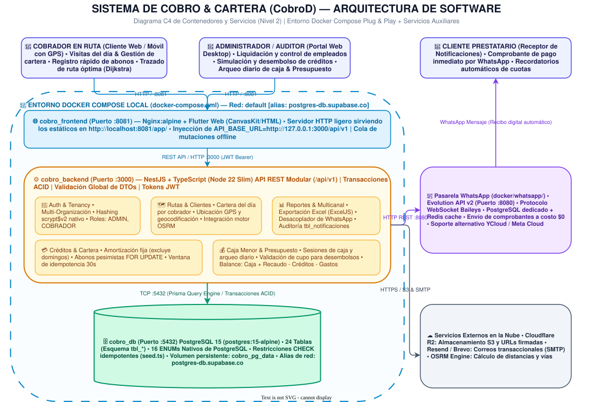

# Sistema de Cobro & Cartera (CobroD)

Monorepo integral para la gestión y administración financiera de microcréditos, cobranza en ruta, tesorería (caja menor), ruteo georreferenciado y notificaciones transaccionales multicanal.

---

## 1. Arquitectura del Monorepo



El repositorio está organizado en aplicaciones y servicios desacoplados:

- **Backend (`backend/`)**: API REST construida con **NestJS**, **TypeScript**, **Prisma ORM** y **PostgreSQL 15**. Implementa arquitectura modular, transacciones ACID con bloqueos pesimistas, control de concurrencia y validaciones de seguridad de grado financiero.
- **Frontend App (`frontend/`)**: Cliente multiplataforma desarrollado en **Flutter (Dart 3)**, orientado principalmente a Web (CanvasKit/HTML) y adaptable a dispositivos móviles (Android/iOS). Incluye ruteo interactivo sobre mapas, soporte para mutaciones offline y componentes neomórficos.

- **Infraestructura Docker (`docker-compose.yml` y `docker/`)**: Entorno contenerizado para despliegue local inmediato (plug-and-play) y pasarela de mensajería independiente con **Evolution API v2** (WhatsApp vía Baileys a costo \$0).

---

## 2. Base de Datos: Arquitectura y Transición

### Motor Activo: PostgreSQL 15
El sistema opera de forma nativa sobre **PostgreSQL 15** (disponible localmente vía Docker con la imagen `postgres:15-alpine`).

### Origen y Transición desde CockroachDB
- **Historial**: El esquema inicial del proyecto fue concebido y modelado originalmente en CockroachDB Cloud (`backend/database/cockroach_init_cobrod.sql`).
- **Estandarización**: Para garantizar un entorno de desarrollo local ágil, ligero y 100% reproducible sin depender de clústeres distribuidos en la nube, se estandarizó toda la base de datos hacia **PostgreSQL 15 estándar (ANSI SQL)**.

- **Sincronización Ágil y Restricciones CHECK**: Se utiliza `npx prisma db push` para mantener sincronizado el esquema. Dado que Prisma no gestiona restricciones `CHECK` de forma nativa en su esquema, el script `backend/prisma/seed.ts` las inyecta de forma idempotente (`gas_monto > 0`, `cre_total > 0`, saldos no negativos, etc.).

---

## 3. Despliegue Rápido Local con Docker (Plug & Play)

El proyecto incluye un entorno preconfigurado que levanta la base de datos, la API y la aplicación web en un solo comando:

```bash
docker compose up -d --build
```

### Servicios incluidos:
1. **`postgres-db`**: Base de datos PostgreSQL 15 (`postgres:15-alpine`) en el puerto `5432`, con persistencia en el volumen `cobro_pg_data` y alias de red `postgres-db.supabase.co`.
2. **`backend`**: Servidor NestJS en el puerto `3000`. Al iniciar, sincroniza automáticamente la base de datos (`npx prisma db push`), ejecuta el seed compilado e inicializa la API.
3. **`frontend`**: Cliente Flutter Web compilado en modo producción y servido a través de un contenedor ligero de Nginx en el puerto `8081`.

### Acceso inmediato:
- **Aplicación Web**: [`http://localhost:8081/app/`](http://localhost:8081/app/)
- **API Backend**: [`http://127.0.0.1:3000/api/v1`](http://127.0.0.1:3000/api/v1)

### Credenciales iniciales por defecto:
- **Usuario**: `prueba`
- **Contraseña**: `adminprueba!BB`
- **Rol**: `ADMINISTRADOR`

*(Para detener el entorno: `docker compose down`, o `docker compose down -v` para reiniciar datos desde cero).*

---

## 4. Desarrollo Local Manual

Si prefieres ejecutar los servicios de forma individual en tu máquina local:

### 4.1 Backend (NestJS + Prisma)

Requisitos: Node.js 22+ y una instancia de PostgreSQL en ejecución.

```bash
cd backend
cp .env.example .env
npm install
npm run prisma:generate
npx prisma db push
npm run seed
npm run start:dev
```

- La API local quedará disponible en `http://127.0.0.1:3000/api/v1`.
- El script de seed creará los catálogos y el administrador inicial utilizando las variables `ADMIN_USERNAME`, `ADMIN_PASSWORD`, etc., definidas en `.env`.

### 4.2 Frontend (Flutter Web)

Requisitos: Flutter SDK (canal `stable` ^3.6.0) y Google Chrome.

```bash
cd frontend
flutter pub get
flutter run -d chrome --dart-define=API_BASE_URL=http://127.0.0.1:3000/api/v1
```

*(En emulador de Android puede utilizarse `--dart-define=API_BASE_URL=http://10.0.2.2:3000/api/v1`).*


## 5. Módulos y Funcionalidades Principales

- **Autenticación y Tenancy**: Soporte multi-organización, tokens JWT de corta duración, control de acceso basado en roles (`ADMINISTRADOR`, `COBRADOR`, `AUDITOR`, `SUPER_ADMIN`) y contraseñas protegidas mediante `scrypt$v2` nativo (`node:crypto`).
- **Logística de Rutas y Ruteo Inteligente**: Asignación de cartera diaria por cobrador, geolocalización GPS de clientes, mapas interactivos con FlutterMap y cálculo de ruta óptima en tiempo real utilizando el algoritmo **Dijkstra** y el motor **OSRM**.
- **Gestión Integral de Créditos**: Simulación y amortización financiera (cuotas fijas, desglose exacto de capital e intereses, exclusión de domingos), validación de fondos en caja menor antes del desembolso y refinanciación de saldos.
- **Recaudo Transaccional Seguro**: Aplicación de pagos con bloqueo pesimista `FOR UPDATE`, ventana de idempotencia de 30 segundos para evitar cobros dobles por latencia de red y liquidación automática de cuotas en cascada.
- **Caja Menor y Presupuesto**: Apertura y arqueo diario de caja, vigencia horaria con cierre automático, registro de gastos operativos con validación de saldo disponible y consolidación contable en tiempo real:
  $$\text{PRESUPUESTO} = \text{CAJA MENOR} + \text{RECAUDADO} - \text{CRÉDITOS} - \text{GASTOS}$$
- **Exportaciones Contables en Excel**: Generación de reportes operativos (Cobros de Ruta, Créditos, Movimientos de Caja Menor) formateados con `exceljs`, visor interactivo previo a la descarga y almacenamiento en Cloudflare R2 con URLs presignadas.
- **Notificaciones Multicanal**:
  - **WhatsApp**: Conector desacoplado con soporte para **Evolution API v2** (`docker/whatsapp/`, Baileys WebSocket a costo \$0) y conector corporativo con **Meta Cloud API / YCloud**.
  - **Correo Electrónico**: Integración con **Resend** y respaldo SMTP con **Brevo**.

---

## 6. Controles de Seguridad Incluidos

- **Consultas Parametrizadas**: Consultas SQL protegidas y tipadas mediante Prisma y TypeORM/SQL nativo parametrizado, con identificadores normalizados a formato UUID.
- **Contraseñas Endurecidas**: Algoritmo `scrypt` con parámetros de alto costo computacional ($N=32768, r=8, p=3$), generación de salt aleatorio criptográfico y re-hashing automático en login si se detectan parámetros obsoletos.
- **Protección de Red y Cabeceras**: Helmet habilitado, CORS con lista blanca estricta, rate-limiting global y reforzado para endpoints sensibles de autenticación (`/auth/login`).
- **Resiliencia Offline en Campo**: Cola de mutaciones offline en el cliente Flutter para registrar abonos y clientes en zonas sin cobertura celular, sincronizando en segundo plano al reconectar.
- **Almacenamiento Seguro**: Archivos temporales y reportes protegidos en buckets privados de Cloudflare R2 mediante firmas temporales de corta expiración (TTL entre 60 y 900 segundos).
- **Validación de Webhooks**: Verificación estricta de firmas HMAC y marcas de tiempo para webhooks entrantes de pasarelas de pago y mensajería.

